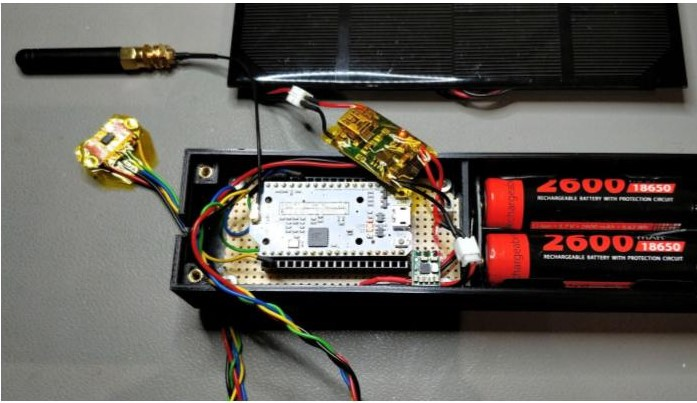
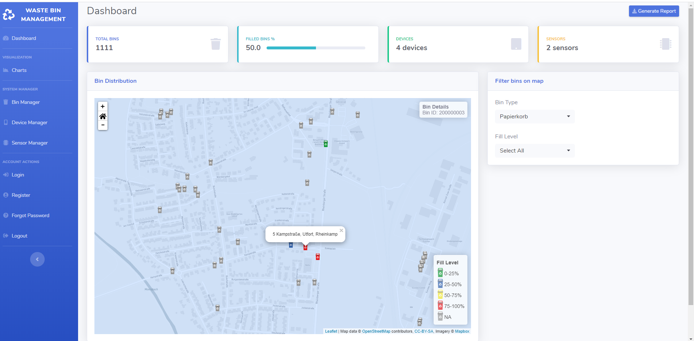
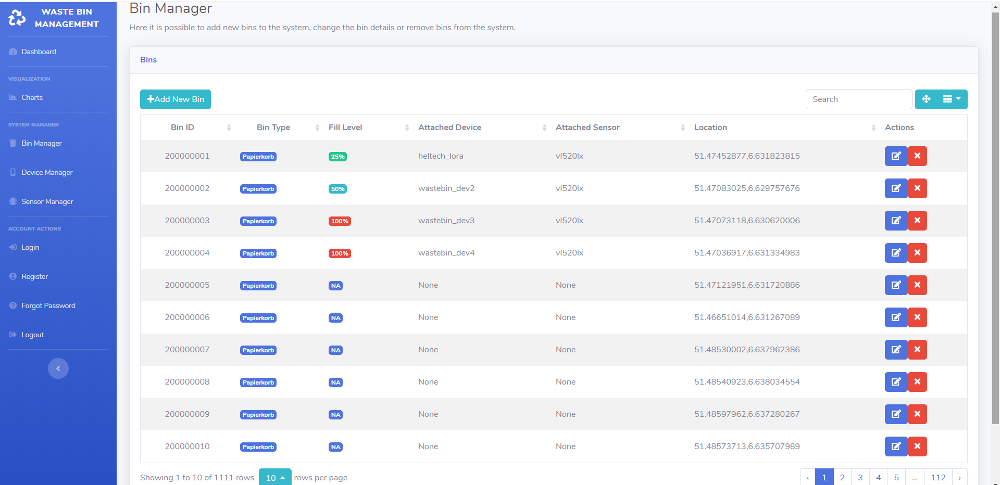
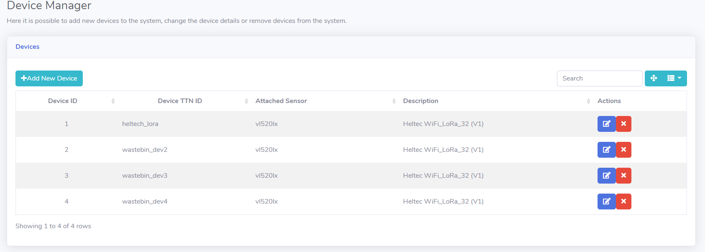

# EMRP19: Waste Bin Fill Level Management
Environmental Monitoring Research Project WS19/20 to monitor fill-level of trash bins in the city of Moers using LoRa technology 

Built upon the structure of previous EMRP18 project ["Smart Cities: Internet of Waste Bins with LoRa"](https://github.com/emrp/emrp2018_Moers_Trashbins) with several modifications.

**Supervisor:** Prof. Dr. Rolf Becker

**Project members:** Andreas Markwart, Thi Yen Thu Nguyen, Sarah-Maria Rostalski, Nader Kaake

### Table of contents
[1. Introduction](#1-introduction)

[2. Materials and methods](#2-materials-and-methods)

[3. Implementation](#3-implementation) 

[4. Results and discussion](#4-results-and-discussion)

[5. Conclusion and outlook](#5-conclusion-and-outlook)

### 1. Introduction

Waste bin level management in big cities is one of the main topics in planning smart cities. Public waste bins help to keep the urban scene and the environment cleaner. However, traditionally employees of the municipal cleaning companies have to manually identify whether a bin is full to empty it. This makes it time-consuming and inefficient as every single bin has to be checked. The variations in fill level also depend greatly on the location of the bin and the occurrence of events in the surroundings. Additionally, current clearing schemes rely on regular schedules which are inflexible for irregular events. To clear a bin when it is not empty is also a waste of resource.

In order to address this problem, this project extends the work of the previous EMRP18 project in an attempt to offer a fully operational solution for managing the fill level of a certain type of waste bins in the city of Moers. The basic idea is to use independent hardware modules that can be easily mounted inside the bins to collect data reflecting the fill level of the bin. The data is transmitted through LoRa protocol to the backend services where it is stored. The network of bins as well as hardware modules are digitally represented by a database which can be conveniently visualized for better management.

A meeting with ENNI, an infrastructure service provider for Moers and other cities in the region, also the main stakeholder of the project is planned at the end of the project to demonstrate the concept, as well as the functional prototype. 

### 2. Materials and methods

The main objective of this project is to monitor the fill level of waste bins through the collecting of sensor data. To achieve this goal, a time-of-flight distance sensor is used to measure the distance between the top of the bin and the surface of the filled trash. The fill level is then calculated based on the maximum bin fill level and this measurement. A microcontroller with LoRa capability is used to collect the sensor data and transmit it to a LoRa gateway registered on The Things Network (TTN). The data uploaded to TTN can be retrieved through an MQTT Subscriber and stored on a database server for further applications. 

Based on [data provided by ENNI](code/database/paper-bins.csv), this project proposes visualizing the locations of the bins of interest on a map so that the system manager has a good overview of the distribution and status of the bins in the city of Moers. However, instead of using third-party softwares like QGIS (used in previous year's project) which also requires certain level of skills in order to operate, this project develops a web interface that allows simple and interactive management even for the normal users. Additionally, a stand-alone application is developed to provide the shortest possible route for emptying bins that are registered as full by the monitoring system.

### 3. Implementation

The following diagram illustrates the architecture of the system. 


#### 3.1. Measurement device

The prototype of the measurement device has the following requirements:

- It should be battery-powered to be portable and attachable to any bin
- It should be easily mountable on the bin
- It should be fully enclosed to prevent physical damage and avoid contact with the trash
- It should automatically senses fill level at regular intervals
- It should transmit sensor data over LoRaWAN protocol 
- Transmitted packets should preferably be encoded
- Power-saving capability is desirable to minimize battery usage and thus less effort  

To fulfill these requirements, the microcontroller used in the final prototype is the `Heltec LoRa board v1` which comes with built-in LoRa and deep-sleep capability to save power. The sensor used is [Adafruit VL53L0X](https://www.adafruit.com/product/3316) Time-of-flight distance sensor breakout board. The board is programmed using C++/Arduino to execute the required functions.

Details on how to set up the microcontroller, the sensor ready for uploading encoded packets to TTN can be found in the [Node Setup Guide](/documentation/node_setup.md).

Details to the node hardware housing and its replication can be found in the [Housing documentation](/code/housing/README.md).

#### 3.2. Supporting applications

- Prerequisites
    - [Python 3.7](https://www.python.org/downloads/release/python-376/)

- On the backend, the following applications are required:

    - A PostgreSQL database server to store the last sensor value measured from any active device, and details of physical entities of the system (bin, device, sensor). 
    - A Flask web server to provide a web management interface of the bins, devices and sensors.
    - Optionally, an InfluxDB database server to store all sensor values ever recorded from any active devices.

    The full instructions on how to set up the database server(s) can be found in the [Database Setup Guide](documentation/database_setup.md).

    The full instructions on how to set up the Flask web server can be found in the [Flask Web Server Setup Guide](documentation/flask_setup.md).

- A stand-alone MQTT Subscriber application is developed in Python to retrieve LoRa packets uploaded on TTN and insert values in database. The source code can be found [here](code/database/ttn_mqtt_to_db.py). Please run the following commands in Terminal to install required libraries before executing the script:
    ```
    pip install paho-mqtt
    pip install psycopg2
    pip install influxdb 
    ```
    To run the application in the background the following commands can be used: 
    ```
    screen -S mqtt_subscriber
    python ttn_mqtt_to_db.py
    ```
    Press `Ctrl + A` then `D` to detach the screen session while keep it running in the background. To reattach the session, run `screen -r mqtt_subscriber`.

- A stand-alone application is developed in Python to calculate the shortest path between full bins. Instructions about the installations of required packages can be found [here](shortest_path_setup.md). The source code of the application can be found [here](code/bin_routing/moers_bins.ipynb). 

### 4. Results and discussion
The measurement device prototype is fully enclosed with a 3D printed casing which allows all hardware and power modules to be safely embedded inside. It can also be easily mounted on the metal waste bin due to magnet mechanism.



The measurement device is able to wake up from deep-sleep to measure the fill level and transmit data packets over LoRaWAN at a regular interval and goes into deep-sleep mode in between. The following figure shows the encoded data packets received on TTN:


However, the only reliable authentication method for LoRaWAN protocol so far given the current embedded software and available LoRaWAN Gateway is Activation by Personalization (ABP), which is less secure than Over-the-air Activation (OTAA). Additionally, current consumption in deep-sleep mode is 2mA which is far from ideal and thus the actual level of battery saving can be deemed as little.

On the server side, the database server(s) are properly set up and the MQTT Subscriber is able to reliably retrieve and store in database(s) all packets sent by TTN MQTT Broker, even from different devices:


The Flask Web Server is also properly setup and the main Dashboard of the web management interface can be used to have an overview of the bin distribution and fill levels:



Additionally, the web interface allows the system manager to make changes to all physical entities in the system through the Bin Manager, Device Manager and Sensor Manager tools:






Finally, the stand-alone application for route calculation is able to query the locations of bins that reach a certain level and reliably generate the shortest route between them. This saves time and resources when clearing the bins. The following image highlights the calculated route for containers that are more than 60% full in red:


The application also generates at the same time shape-files of the calculated route which can easily be imported into third party software like QGIS for further analysis:


### 5. Conclusion and outlook

In conclusion, this project has successfully developed a prototype measurement device with improvements from previous year's project including complete portability, battery power supply, enclosure and mounting options. Future improvement would be to consider solar energy as a source of power to extend battery life. 

On the software side, this project has taken the bin monitoring task to the next level using interactive web interface and shortest path calculation algorithms to further reduce time and resources required to empty filled bins. An improvement would be to configure notifications when certain amount of bins are full in an area flexibly depending on upcoming events, and automatically execute the shortest-route application at a pre-defined time slot each day. 
