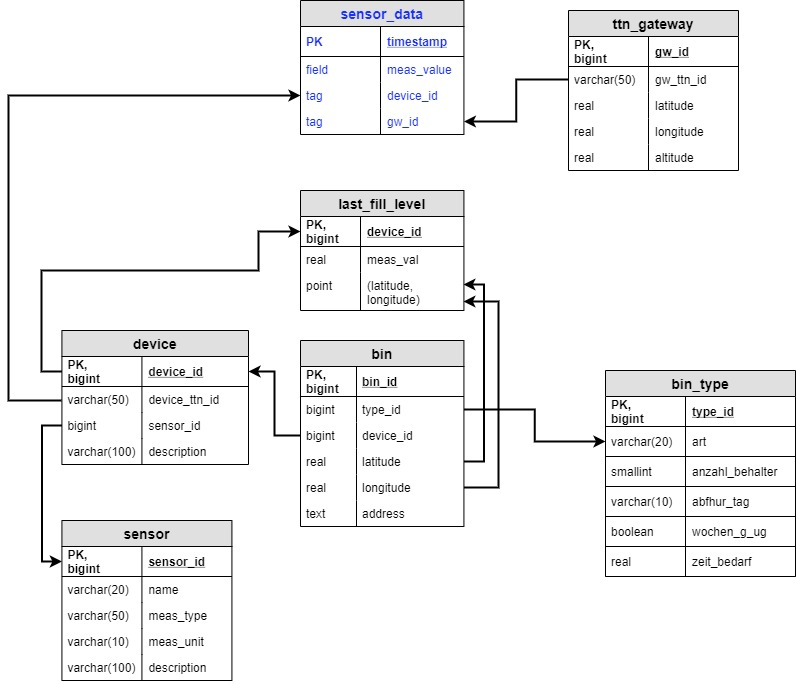

#### 1. Database Relational Structure
The original database structure from EMRP18 is modified such that the `sensor_data` table is separately initiated in an `InfluxDB` database, while the remaining tables are still stored in a `PostgreSQL database`. The reason being PostgreSQL is not optimized for streaming data, which is the sensor data in this case; but is more suitable for relational data tables. Meanwhile, storing all meta-data in the `InfluxDB` table would give one series for each combination of meta-data, resulting in too many series in the end and thus slowing down the querying process. Thus, only the most important meta-data of the TTN MQTT messages including `gateway ID` and `device ID` will be used as `tags` for each insertion into InfluxDB. 
Additionally, a new table called `bin_type` is added to describe the common properties of the bins. In this case, we only have 1 bin type as can be seen in the [CSV data given by ENNI](../code/database/paper_bins.csv).

Below is a digram of the new database structure.



*Note:
- "sensor_data" table is stored in InfluxDB
- remaining tables are stored in ProgreSQL


#### 2. Initialization of database
- Insert the first bin type into `bin_type` table:
```
type_id: 1
art: Papierkorb
anzahl_behalter: 1
zeit_bedarf: 0.5 
```

- Insert all bins and its location from the [paper_bins.csv](../code/database/paper_bins.csv) file into the `bin` table using [this Python script](../code/database/insert_bin_data.py).

- Insert the first sensor type into `sensor` table:
```
sensor_id: 1
name: vl520lx
meas_type: distance
meas_unit: cm
description: VL53L0X Time-of-Flight Distance Sensor Breakout Board 
```

- Insert the first device into `device` table:
```
device_id: 1
device_ttn_id: heltech_lora            #id of gateway as registered in The Things Network
sensor_id: 1
description: Heltech WiFi_LoRa_32 (V1)
```

 Insert the first gateway into `gateway` table:
```
gw_id: 1
gw_ttn_id: eui-b827ebfffe21faed        #id of gateway as registered in The Things Network
latitude: 51.49
longitude: 6.54
altitude: 7
```

#### 3. Fetch sensor data from TTN MQTT Broker and save to database
As shown in [this section](node_setup.md#6), the payload from TTN is a dictionary with several parameters, among which we save the value of `digital_out_1` from the `Payload fields` as sensor data and the `gtw_id` and `device_id` as tags. The Python script to perform this task is found [here](../code/database/ttn_mqtt_to_db.py).