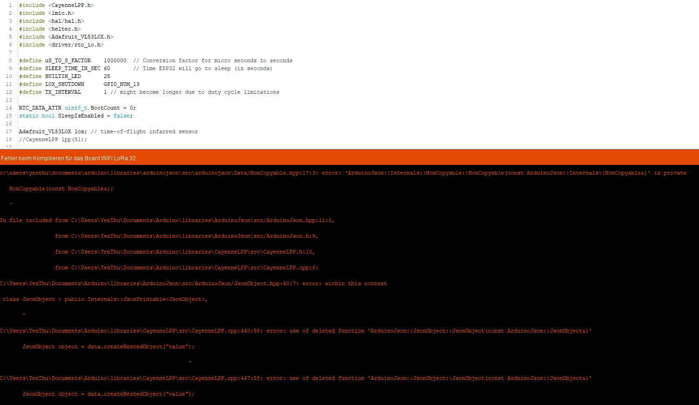
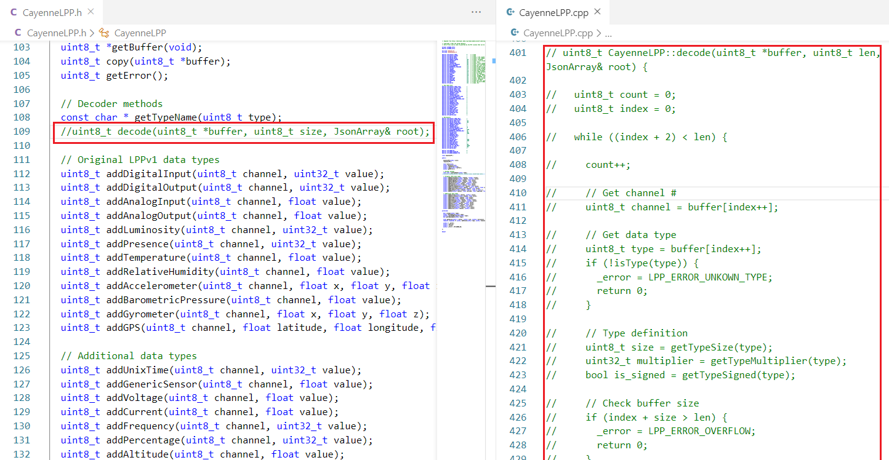
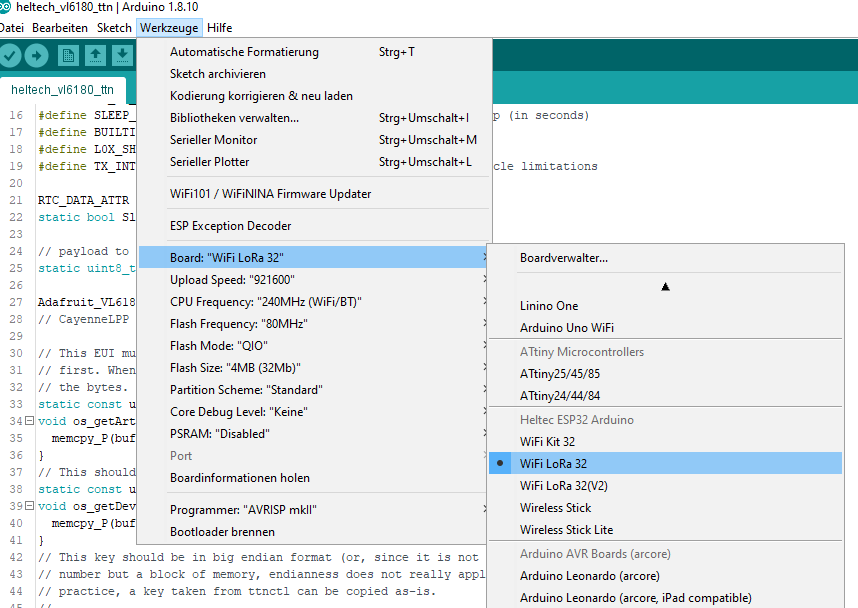
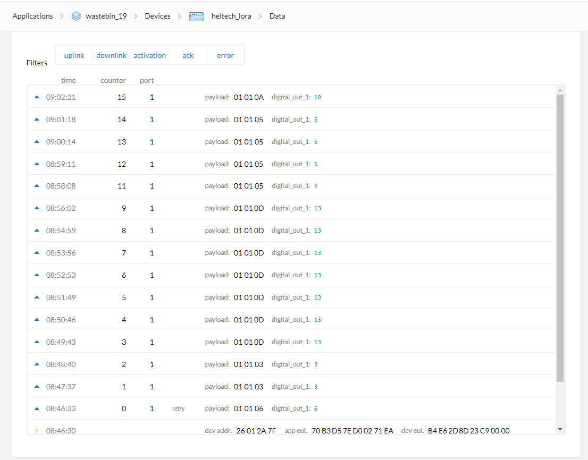
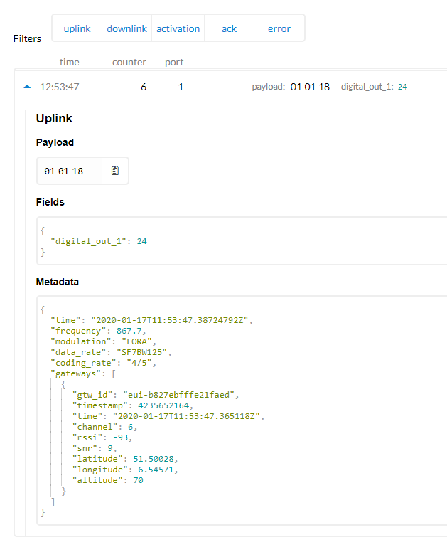

# Node Setup Guide

A summary of steps to set up the hardware needed for monitoring the fill level of the trash bin and send the data to The Things Network.

Is based on previous work by EMRP18 project _"Smart Cities: Internet of Waste Bins with LoRa"_ as described in [this documentation](https://github.com/emrp/emrp2018_Moers_Trashbins/blob/master/documentation/from_sensor_to_ttn.md).

The following document will only summarize the steps taken and highlight **(in bold)** the modifications made compared to the previous work, for details please refer to the linked documentation above.

## 1. Prepare hardware
### Components
 - Heltec WiFi LoRa 32 Board ([V1 or V2](https://heltec.org/project/wifi-lora-32/?lang=en)) with 868MHz antenna
 - Adafruit Time of Flight Distance Sensor breakout board [VL53L0X](https://www.adafruit.com/product/3316)
 - 1x Pololu 5V voltage converter [S7V7F5](https://www.pololu.com/product/2119)
 - 2x 18650 protected Li-ion cells
 - 2 Slot 18650 battery holder

- Required components:
    - Heltec WiFi_LoRa_32 ESP32-based module with 868MHz antenna (V1)
    - [Adafruit VL53L0X](https://www.adafruit.com/product/3316) Time-of-flight distance sensor breakout board
- Pin headers have to be soldered to both modules. 
- Connect the antenna to the Heltec WiFi_LoRa_32 module before powering it with 5V over mciroUSB cable.

#### 2. Set up Arduino IDE
- [Install Arduino IDE](https://github.com/emrp/emrp2018_Moers_Trashbins/blob/master/documentation/from_sensor_to_ttn.md#2-software-installation)
- Within Arduino IDE:
    - Add board definitions for the `Heltec WiFi_LoRa_32` module **using instructions from [Heltec documentation](https://docs.heltec.cn/#/en/user_manual/how_to_install_esp32_Arduino)**. The method described in EMRP18 project did not work for this module (V1).
    - Use Arduino IDE Library Manager to install required libraries by clicking on `Tools -> Manage Libraries...` and search for the name of the library:
        -  Install `Heltec ESP32 Dev-Boards` library by `Heltec Automation` **using Arduino Library Manager instead of the ZIP-library**.

        

        - Install `Adafruit VL53L0X` library by `Adafruit` (tested version 1.0.5)
        - Install `MCCI LoRaWAN LMIC` library by `IBM, Mathis Koojiman, Terry Moore, ChaeHee Won, Frank Rose` (tested version 3.1.0)
        - Install `Heltec ESP32 Dev-Boards` by `Heltec Automation` (tested version 1.0.9)
        - Install (if not available) or **UPDATE** (if already existing) the `ArduinoJson` library by `Benoint Blanchon`. (tested version 6.14.1) **It is important to have the latest version of the library, otherwise the CayenneLPP library will throw error**
        - Install `CayenneLPP` library by `Electronic Cats` (tested version 1.0.3)
        - `CayeneLPP` library can be modified `(WITH CAUTION)` if the following error appears in the compiler output of Arduino IDE:

            

            - The error lies in the usage of the ArduinoJson library which is called in the `decode()` function of CayenneLPP library. Since in this case we only need to encode but not decode the data for sending, we can work around this by deactivate this function in the CayenneLPP library by commenting out the highlight parts:

            

            - After this the compiler should compile fine.

#### 3. Hardware Connections
- The wiring between the Heltec WiFi_LoRa_ESP32 V1 board and the VL53L0X sensor is summarized in the following table:

Heltec WiFi_LoRa_ESP32 V1 Pin | VL53L0X Breakout board Pin 
---------|----------
 3V3 | Vin 
 GND | GND 
 15 (SCL) | SCL
 4 (SDA) | SDA
 13 | XSHUT 

The pin-out diagram of the Heltec WiFi_LoRa_ESP32 V1 is available [here](https://github.com/Heltec-Aaron-Lee/WiFi_Kit_series/blob/master/PinoutDiagram/WIFI_LoRa_32_V1.pdf). 

#### 4. Set up The Things Network Console
- [Add a new application](https://github.com/emrp/emrp2018_Moers_Trashbins/blob/master/documentation/from_sensor_to_ttn.md#41-setting-up-a-new-ttn-application)
- [Register a new device with OTAA Activation method](https://github.com/emrp/emrp2018_Moers_Trashbins/blob/master/documentation/from_sensor_to_ttn.md#43-registering-a-device)

#### 5. Upload code to ESP32 module
- Download the code from [here](code/heltec_vl53l0x_ttn/heltec_vl53l0x_ttn.ino).
- [Edit the LMIC config file](https://github.com/emrp/emrp2018_Moers_Trashbins/blob/master/documentation/from_sensor_to_ttn.md#514-editing-the-lmic-config-file).
- [Copy the device keys from TTN Console to the code.](https://github.com/emrp/emrp2018_Moers_Trashbins/blob/master/documentation/from_sensor_to_ttn.md#512-device-keys)
- Under `Tools -> Board` choose **WiFi LoRa 32** from `Heltec ESP32 Arduino`

- Connect the board to PC, under `Tools -> Port` select the correct port
- Upload the code

#### 6. Verify data received by TTN gateway

- Check the TTN Console for received data

- Below is the detailed description of the data

